# Cara membuat program python "Menentukan Bilangan terbesar"dengan Sublime text

1.Buka Sublime text

2.kemudian set view ==>Syntax==> python , seperti berikut ini

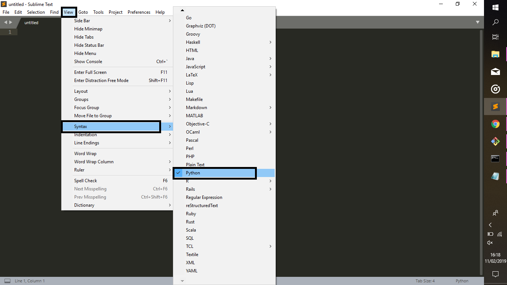

3.ikuti coding seperti berikut ini

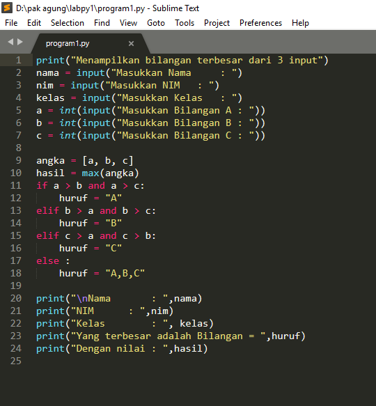

4.setelah selesai lalu di simpan

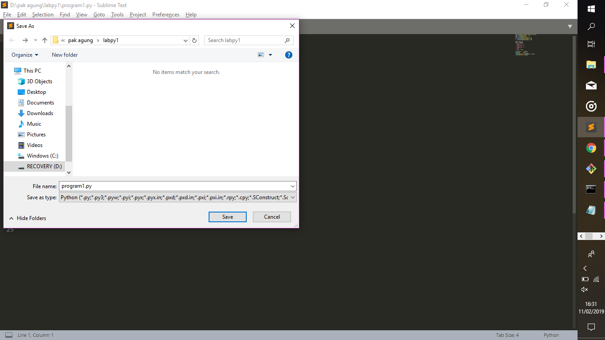

5.code input(kode ini di gunakan sebagai masukkan/input-an pada program)

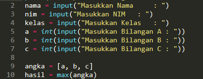

6.code if

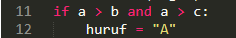

7.code elif

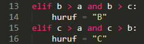

8.code else

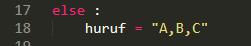

9.code output(kode ini di gunakan untuk menampilkan hasil program)

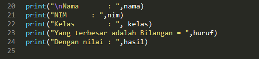

10.kemudian kita akan menjalan program menggunakan cmd. tekan windows+r lalu ketik cmd kemudian enter

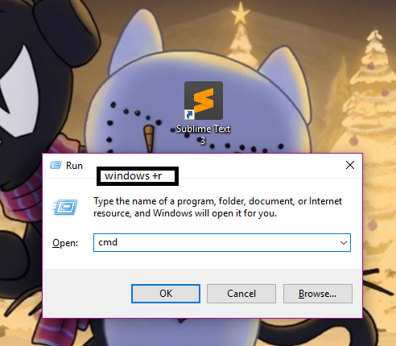

11.masuk ke directory folder tempat anda menyimpan file

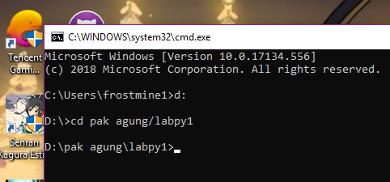

12.ketik nama file yang anda buat

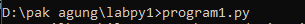

13.masukkan data sebagai berikut

  contoh bilangan terbesar A

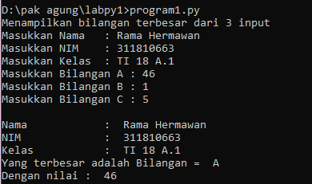

  contoh bilangan terbesar B

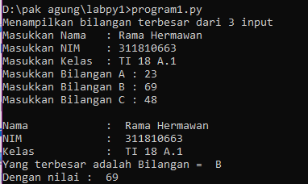

  contoh bilangan terbesar C

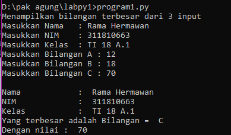

Sekian dan Terima kasih